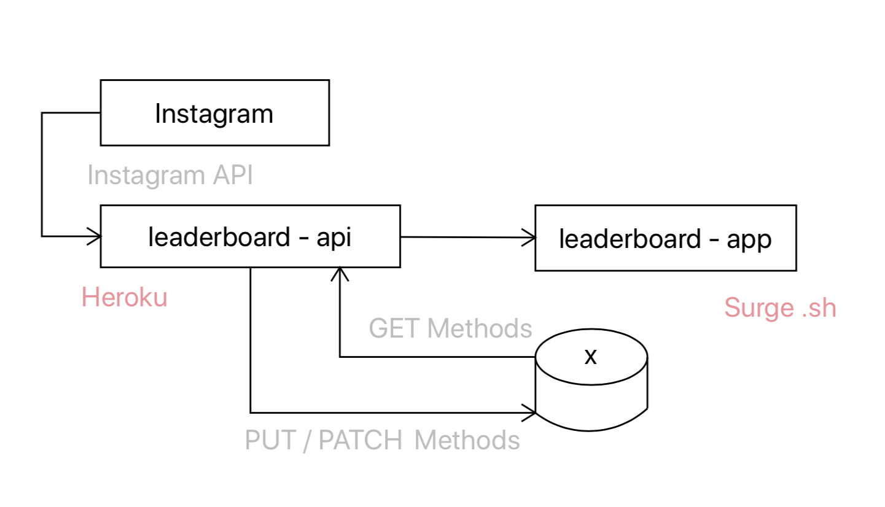
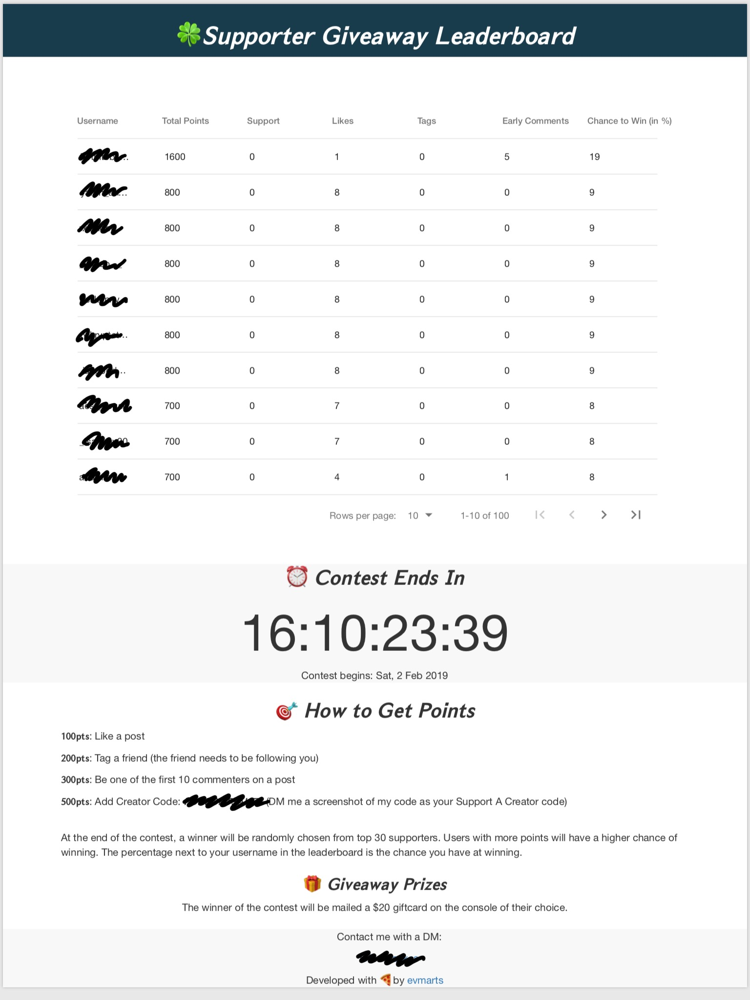

# leaderboard

The goal of this project is to host a leaderboard to facilitate a contest on an Instagram account. The leaderboard will rank contestants based on how much they engage with the account. 

## Motivation

We want to drive engagement on an Instagram account. 

## How it works

The leaderboard communicates with the Instagram API to give us access to the data pertaining to the Instagram account hosting the contest. We are then able to look at this data and award points to the users who engaged with the account. 

## Architecture

The architecture of the system consists of four main entities:

1. **Instagram** is where users engage with the account. This system uses the ```instagram-private-api``` project to communicate with Instagram 
2. **leaderboard-api** is the back-end of the system. It talks to Instagram, updates a database and supplies data to the front-end. It is hosted on Heroku.
3. **Postgres database** is where we keep all the data for the leaderboard. It is also hosted on Heroku. 
4. **leaderbaord-app** is the front-end of the system (this repo). See the *Example* section below for what it looks like. It is hosted on Surge.



## Examples

The following is an example of a contest held on one of my Instagram accounts:



