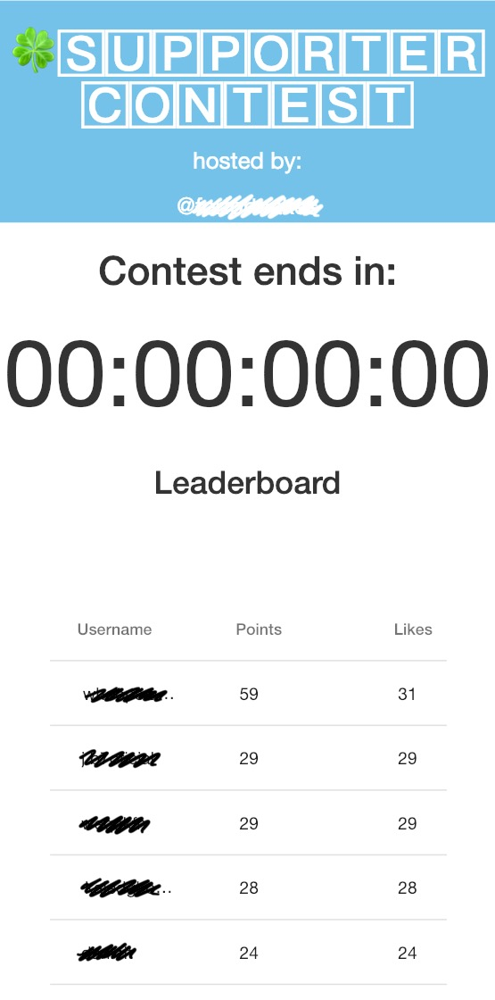

# leaderboard

The goal of this project is to display a leaderboard for an Instgram contest.

## Motivation

We want to grow our Instagram account with natural methods. We award points to followers whenever they e.g. like, comment, tag a friend on our content. 

We need to be able to let our followers see their place in number of points. So we make a website to display the leaderboard. 

## Examples

The following is a screenshot of the website that held the leaderboard for a contest on an Instgram account:

